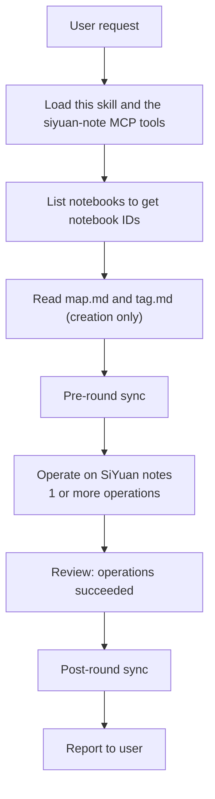
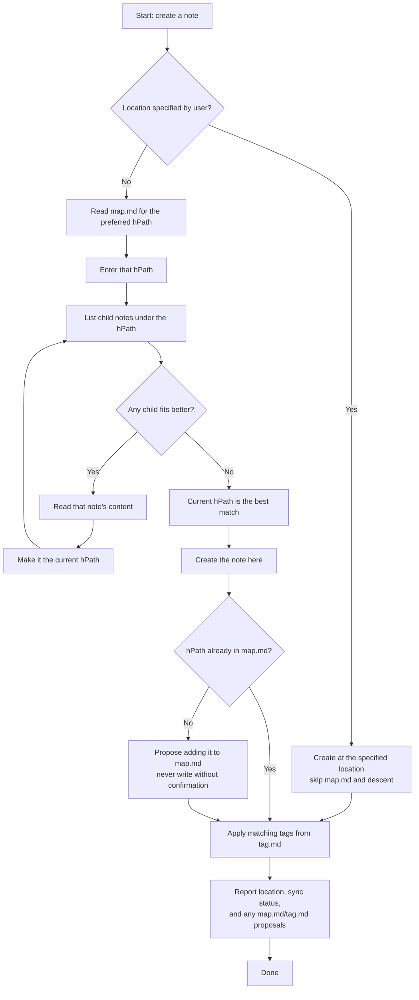

# Personal SiYuan Standards

Personal note-taking conventions for the user's SiYuan (思源笔记) vault. This
skill is a routing-and-convention layer, not an operation layer — all actual
operations (create doc, search, tag, …) are performed with the siyuan-note MCP
tools. It answers two questions for every new-note request:

- **Where does a new note belong?** → `map.md` (creation only; locate existing notes by search)
- **What should a new note be tagged with?** → `tag.md`

## Requirements

- The **siyuan-note MCP** server is connected and its tools are loaded
  (notebook, document, search, block/attr, …). If they are not available, stop
  and tell the user to connect the MCP server before continuing.

## Runtime Files

All runtime data lives in `~/.wmyskills/personal-siyuan-standards/`:

| File | Purpose | Maintained by |
|------|---------|---------------|
| `map.md` | Notebook → hPath mapping for new notes (creation only) | user (agent proposes) |
| `tag.md` | Tagging rules: which tags to apply to new notes, when | user (agent proposes) |

**First run:** if `map.md` or `tag.md` is missing, create it by copying the
matching template from this skill's `references/` (`map.example.md`,
`tag.example.md`), then continue. Never recreate an existing file.

**Write policy (both files):** the user maintains these files. When the agent
learns something worth recording (a new location, a new tag), propose the
change in the final report and write it only after the user confirms. One-off
decisions are never written automatically.

**Explicit user instructions always override these standards.**

## Map: Where New Notes Go (`map.md`)

Read `map.md` when **creating** a note and the user did not explicitly
specify a location — it routes new notes to their home hPath and is not used
to locate existing ones (search instead). It is a markdown table with three
columns:

| Column | Meaning |
|--------|---------|
| `Notebook` | The SiYuan notebook the new note lives in |
| `hPath` | Human-readable path inside the notebook (e.g. `/Parent/Child`) — never includes the notebook name, see Path below |
| `Description` | What this location is for, and when to prefer it |

**Matching.** Pick the row whose Notebook, hPath, and Description best match
the user's request by meaning — not by keyword equality. If several rows
could fit, prefer the one whose description matches the intent of the
current request (e.g. a research location for a reading note, a work location for
a work note). The chosen row is only the **starting point**: the Create
workflow then descends recursively into child documents to find the
best-fitting location (see Create below).

**No match?** Two cases, in order:

1. If some row's `Description` explicitly declares itself the fallback (e.g.
   "Use this when nothing else matches/未匹配时使用此" — use this Notebook and hPath when nothing else matches), place the
   note there.
2. Otherwise decide the placement yourself — look at the actual notebook
   hierarchy and the note's content, and choose a sensible home. This decision
   is **one-off**: use it for this request only, do **not** append it to
   `map.md`. You may propose adding a row in your final report.

**hPath.** SiYuan's human-readable path is rooted *inside*
the notebook and **never includes the notebook name** — the notebook is
always selected separately (the `Notebook` column here; the `notebook`
parameter of MCP calls). Example: for a doc `2026-08-10` under `2026/08` in
notebook `Daily`, the hPath is `/2026/08/2026-08-10` — writing
`/Daily/2026/08/2026-08-10` is wrong. A leading `/` denotes the notebook
root. When creating a document at a mapped hPath, create any missing parent
documents first.

## Tag: What to Tag (`tag.md`)

Read `tag.md` when **creating** a note (not for find/modify). Entries look
like:

```markdown
**tagName**: <actual tag name>
Explanation lines: when to apply / not apply this tag
```

- The tag to apply is the name after `**tagName**:`. Lines below may describe
  when to apply / not apply it.
- If an entry's explanation does not mention timing, the default applies: tag
  every new note with it.
- If several entries match the new note, apply **all** of them.
- If no entry matches, do **not** tag the note — and say so in the report.

**Tagging method.** Attach real SiYuan tags by setting the `tags` custom
attribute on the new document's root block (comma-separated) via the MCP
`attr`/`block` tools. Never invent a tag that is not in `tag.md` (unless the
user explicitly asks).

**Modify never touches tags** — tags are only applied when a note is created.

## Syntax Rules

When writing note content (outside code blocks and inline code):

- **Dollar sign `$`** — SiYuan treats `$...$` as inline math. When the
  intention is not to write a formula, escape every `$` as `\$`, even a
  standalone one. Example: `The fee is \$100.` renders as "The fee is $100."
- **Hash sign `#`** — Outside headings and code blocks, `#` can be
  interpreted as a tag marker. When the intention is not to write a tag,
  escape every `#` as `\#`, even a standalone one. Example: `Issues
  \#101 and \#102.` — without escaping, SiYuan would create a tag
  between two `#`. Example: `#tagName#` → a tag; `\#tag\#` → the text "#tag#".

Headings (`#` at line start) use their own syntax and do not need escaping.
Escaping still applies to `$` and `#` inside heading text when not used for
their special purpose.

In code blocks (both inline `` `code` `` and fenced blocks), write `$` and
`#` literally — no escaping needed.

## Link Conventions

Applies whenever note content is written or modified:

- **External links** — links jumping to a web page or a static-resource page:
  use Markdown link syntax `[anchor text](URL)`, which renders as a directly
  clickable link.
- **SiYuan references** — block references and document references: use
  SiYuan's reference syntax — `((blockID "anchor text"))` for a block
  reference, `((docID "anchor text"))` for a document reference, with the
  display text quoted as the anchor.

## One Round Workflow

Every user request is **one round**: from request to report, a round
performs **one pre-round sync** before any operation (even read-only rounds)
and — if any write ran — **one post-round sync**. Never sync after each
individual note operation; bundle the whole round into a single pre/post
sync pair. This is the full round, covering every request:



1. **List notebooks.** Right after the MCP tools load, list notebooks with
   the MCP `notebook` tool and keep their **IDs** — every later MCP call
   that takes a `notebook` parameter needs the ID, not the name. Map rows
   in `map.md` are matched by name; resolve each match to its ID here.
   (Closed notebooks are excluded — if a mapped notebook is missing from the
   list, it is likely closed; ask the user or pick another placement.)
2. **Read standards files.** When the round creates a note, read `tag.md`
   (see Tag rules) and read `map.md` unless the user specified a location
   (see Map rules). Locate existing notes with the MCP `search` tool instead
   of `map.md`.
3. **Pre-round sync.** Trigger a sync with the MCP `sync` tool before any
   operation — create, modify, move, … **and** pure find/read-only rounds.
   It runs exactly once per round, before the first operation.
4. **Operate.** Perform the request — one or more note operations — following
   the operation notes below.
5. **Review.** Check that each operation actually succeeded; if a step
   failed, fix or retry it before moving on.
6. **Post-round sync.** If any write operation ran this round, trigger sync
   again with the MCP `sync` tool.
7. **Report.** Follow Report Style; always include the sync status.

**Sync failure handling.** A failed sync never blocks the round — the
operations still run — but the final report must explicitly warn that the
vault may be out of sync. Do not retry a failed sync, and do not skip the
remaining steps because of it.

## Operation notes

**Create**



1. **User-specified location wins.** If the user explicitly said where the
   note goes (a notebook or path), create it there directly — skip `map.md`
   and the recursive descent. `map.md` and the descent apply only when the
   user did not specify a location.
2. Read `map.md`; pick the target location (see Map rules above). If no row
   matches and none declares itself the fallback, decide a placement yourself
   as a one-off — place the note directly without descending.
3. **Descend to the best-fitting hPath.** From the mapped hPath, list its
   child documents. Judge by title first, then read the most promising
   candidate's content, and ask: does any child fit the request better than
   the current hPath? If one does, make it the current hPath and repeat.
   Stop when no child fits better — the current hPath is the final
   destination.
   There is no depth limit: the descent only moves downward through children,
   so it always terminates.
4. Create the document with the MCP `document` tool — `notebook` selects
   the notebook, and `path` is the **full target path including the
   document name**, not the parent folder (e.g. `notebook: "Daily-notebook-id"`,
   `path: "/2026/08/2026-08-10"`; the notebook name is never repeated inside
   `path`). The parent folder must already exist; create missing parent
   documents first. The tool's response echoes the `path` you passed, so
   verify the real location with siyuna MCP tools when in doubt.
5. **No `h1` in the note body.** The document title is already rendered as
   an `h1`, so never write level-1 headings (`# …`) in the content — start
   section headings at `h2`.
6. Read `tag.md`; apply every matching tag to the new document (Tag rules
   above).
7. Report: where the note was created; whether the placement was a one-off
   guess (no map row) — and optionally propose a `map.md` row or `tag.md`
   entry for user confirmation. If the final hPath is deeper than the mapped
   row (or no row matched), **propose** adding the final hPath to `map.md` —
   never write it without the user's confirmation.

**Find (read-only)**

1. Search with the MCP `search` tool (fulltext) to locate the note —
   `map.md` is only a reference for creating new notes.
2. Open and read a candidate's content to confirm it really is the note the
   user means before reporting it.
3. The pre-round sync still runs for read-only rounds (see One Round
   Workflow); only the post-round sync is skipped because no write ran.

**Modify**

1. Locate the note with the MCP `search` tool (find rules apply).
2. **Read the document's content first and confirm it matches the user's
   intent before changing anything.** Modifying the wrong note is worse than
   asking.
3. If the located document doesn't match, search again; if still uncertain,
   ask the user.
4. Make the change. Do not touch the note's tags.

**Delete / move / rename**

1. Locate the note with the MCP `search` tool (find rules apply).
2. Read the document's content and confirm it is the intended note before
   deleting, moving, or renaming it — the same caution applies as for
   Modify.
3. Perform the operation. For a move, `path` is an **existing** target
   location — the note becomes a child of it, so create the target first if
   needed (the same full-hPath rule as Create applies).
4. Report the note's new location after a move or rename; after a delete,
   report what was deleted and where it lived.

## Report Style

Always tell the user where a note lives after creating/finding/modifying it,
and its new location after a move or rename — with a `Notebook / hPath` so they
can verify. If you made a one-off placement, skipped tags, or couldn't locate
something, say so explicitly. Propose `map.md`/`tag.md` updates when you found
a stable new pattern.

Always report the sync status of the round. If the pre-round or post-round
sync failed, warn explicitly that the vault may be out of sync.
