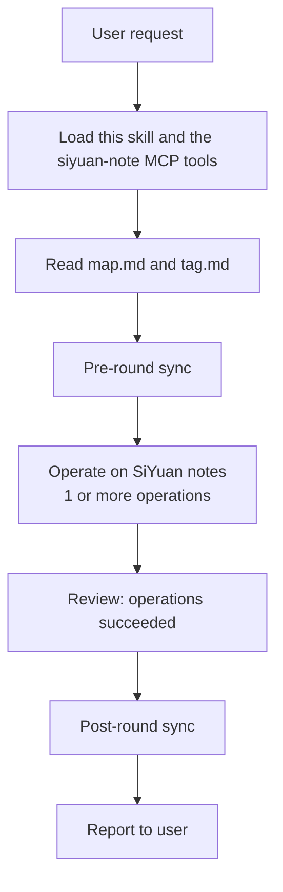

# Personal SiYuan Standards

Personal note-taking conventions for the user's SiYuan (思源笔记) vault. This
skill is a routing-and-convention layer, not an operation layer — all actual
operations (create doc, search, tag, …) are performed with the siyuan-note MCP
tools. It answers two questions for every note request:

- **Where does this note belong?** → `map.md`
- **What should a new note be tagged with?** → `tag.md`

## Execution Rule

Start the requested note operation immediately. Do not pre-check MCP
connectivity, tool availability, or the state of the standard files — if
something is missing or fails, detect it and fix it during the operation.

## Requirements

- The **siyuan-note MCP** server is connected and its tools are loaded
  (notebook, document, search, block/attr, …). If they are not available, stop
  and tell the user to connect the MCP server before continuing.

## Runtime Files

All runtime data lives in `~/.wmyskills/personal-siyuan-standards/`:

| File | Purpose | Maintained by |
|------|---------|---------------|
| `map.md` | Notebook → path mapping: where notes live, where new notes go | user (agent proposes) |
| `tag.md` | Tagging rules: which tags to apply to new notes, when | user (agent proposes) |

**First run:** if `map.md` or `tag.md` is missing, create it by copying the
matching template from this skill's `references/` (`map.example.md`,
`tag.example.md`), then continue. Never recreate an existing file.

**Write policy (both files):** the user maintains these files. When the agent
learns something worth recording (a new location, a new tag), propose the
change in the final report and write it only after the user confirms. One-off
decisions are never written automatically.

**Explicit user instructions always override these standards.**

## Map: Where Notes Live (`map.md`)

Read `map.md` before **every** create, find, or modify operation. It is a
markdown table with three columns:

| Column | Meaning |
|--------|---------|
| `Notebook` | The SiYuan notebook the note lives in |
| `Path` | Human-readable path inside the notebook (e.g. `笔记本/父文档/子文档`) |
| `Description` | What this path is for, and when to prefer it |

**Matching.** Pick the row whose notebook, path, and description best match the
user's request by meaning — not by keyword equality. If several rows could
fit, prefer the one whose description matches the intent of the current
request (e.g. a research path for a reading note, a work path for a work
note).

**No match?** Two cases, in order:

1. If some row's `Description` explicitly declares itself the fallback (e.g.
   "未匹配时使用此路径" — use this path when nothing else matches), place the
   note there.
2. Otherwise decide the placement yourself — look at the actual notebook
   hierarchy and the note's content, and choose a sensible home. This decision
   is **one-off**: use it for this request only, do **not** append it to
   `map.md`. You may propose adding a row in your final report.

**Paths.** Paths use the SiYuan human-readable path form. When creating a
document at a mapped path, create any missing parent documents first.

## Tag: What to Tag (`tag.md`)

Read `tag.md` before **creating** a note (not for find/modify). Entries look
like:

```markdown
**tagName**: 实际标签名字
说明行：什么时候打、什么时候不打
```

- The tag to apply is the name after `**tagName**:`. Lines below may describe
  when to apply / not apply it.
- If an entry's explanation does not mention timing, the default applies: tag
  every new note with it.
- If several entries match the new note, apply **all** of them.
- If no entry matches, do **not** tag the note — and say so in the report.

**Tagging method.** Attach real SiYuan tags by setting the `tags` custom
attribute on the new document's root block (comma-separated) via the MCP
`attr`/`block` tools. Never invent a tag that is not in `tag.md` (unless the
user explicitly asks).

**Modify never touches tags** — tags are only applied when a note is created.

## One Round Workflow

Every user request is **one round**: from request to report, a round performs
**exactly two syncs** — one before the operations (pre-round sync) and one
after (post-round sync). Never sync after each individual note operation;
bundle the whole round into a single pre/post sync pair. This is the full
round, covering every request:



1. **Read standards files.** Read `map.md` every round (see Map rules). Read
   `tag.md` only when the round creates a note (see Tag rules).
2. **Pre-round sync.** If the round will perform any write operation (create,
   delete, modify, move, rename, …), trigger a sync with the MCP `sync` tool.
   Pure find/read-only rounds skip this step.
3. **Operate.** Perform the request — one or more note operations — following
   the operation notes below.
4. **Review.** Check that each operation actually succeeded; if a step
   failed, fix or retry it before moving on.
5. **Post-round sync.** If any write operation ran this round, trigger sync
   again with the MCP `sync` tool.
6. **Report.** Follow Report Style; always include the sync status.

**Sync failure handling.** A failed sync never blocks the round — the
operations still run — but the final report must explicitly warn that the
vault may be out of sync. Do not retry a failed sync, and do not skip the
remaining steps because of it.

### Operation notes

**Create**

1. Read `map.md`; pick the target location (see Map rules above).
2. Create the document with the MCP `document` tool at the mapped
   notebook/path, creating missing parent documents first.
3. Read `tag.md`; apply every matching tag to the new document (Tag rules
   above).
4. Report: where the note was created; whether the placement was a one-off
   guess (no map row) — and optionally propose a `map.md` row or `tag.md`
   entry for user confirmation.

**Find (read-only)**

1. Read `map.md`; use the most plausible rows as your starting point.
2. If the map doesn't point anywhere useful, search with the MCP `search`
   tool (fulltext) to locate candidates.
3. Open and read a candidate's content to confirm it really is the note the
   user means before reporting it.
4. No sync for read-only rounds.

**Modify**

1. Read `map.md`; locate the note (find rules apply).
2. **Read the document's content first and confirm it matches the user's
   intent before changing anything.** Modifying the wrong note is worse than
   asking.
3. If the located document doesn't match, search again; if still uncertain,
   ask the user.
4. Make the change. Do not touch the note's tags.

**Delete / move / rename**

1. Read `map.md`; locate the note (find rules apply).
2. Read the document's content and confirm it is the intended note before
   deleting, moving, or renaming it — the same caution applies as for
   Modify.
3. Perform the operation.
4. Report the note's new location if it moved or was renamed.

## Report Style

Always tell the user where a note lives after creating/finding/modifying it —
with a `Notebook / Path` so they can verify. If you made a one-off placement,
skipped tags, or couldn't locate something, say so explicitly. Propose
`map.md`/`tag.md` updates when you found a stable new pattern.

Always report the sync status of the round. If the pre-round or post-round
sync failed, warn explicitly that the vault may be out of sync.
